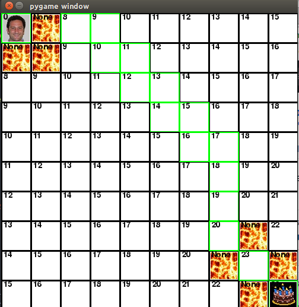

# Cost to Draw Explanation

G score is basically how many tiles it takes to get to the destination from
the start tile. Each tile is weighted 1 point. So for every tile moved, the number
increases by 1. In this image, it takes 18 tiles to get to the destination tile.

H score is the estimated cost of tiles it should take to get to the destination
tile/cake. This number is updated every time the character moves a tile. In this
image, the H score goes up 18.

F score is basically the total of the two scores, G and H. This number is used
to generate the shortest path to the destination tile. This score is updated
every time the character moves. In this image, the final F score is 18. This
matches the score it should have if the G and H scores were added together.

# Diagonals

In this scenario, diagonals are only used when it is the only option to get to
the cake in the shortest route. As you can see in the image, the path that
Paul wants to take is obstructed by lava on three sides. Even though it costs more
to move diagonally, it is the only possible way to get to the cake. It costs 19
points to get there.

# Hops

In this scenario, Paul has to jump over the lava in order to get to his destination.
Even though it costs 8 points, it is used in dire circumstances, like his 3 adjacent
blocks all covered in lava. It is completely necessary to jump over the lava, and
gain those 8 points. Without jumping over, it would be impossible for him to get
to the cake. It costs 26 points to get there.

# Swamped

Lastly, this scenario demonstrates what Paul does when he needs to move through swamp
tiles. This also costs an extra 3 points, on top of whatever movement he is doing.
This skill is only useful when he is trapped by two layers of swamp tiles. It is
completely necessary for him to go through the swamp tiles or else it would be
impossible to get to the cake. It costs 25 points to get there.

